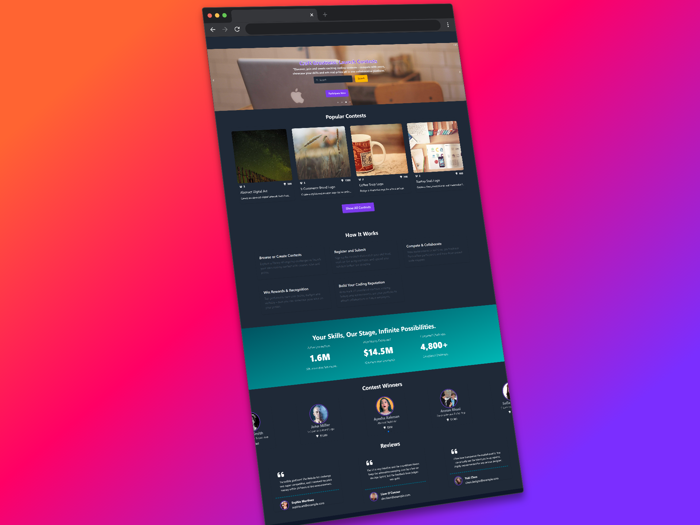
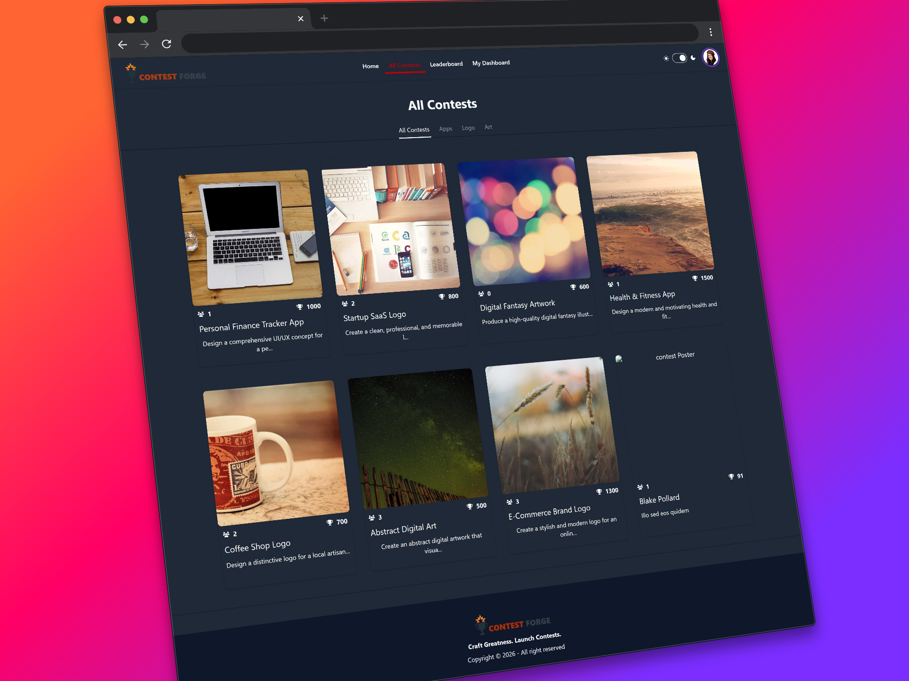
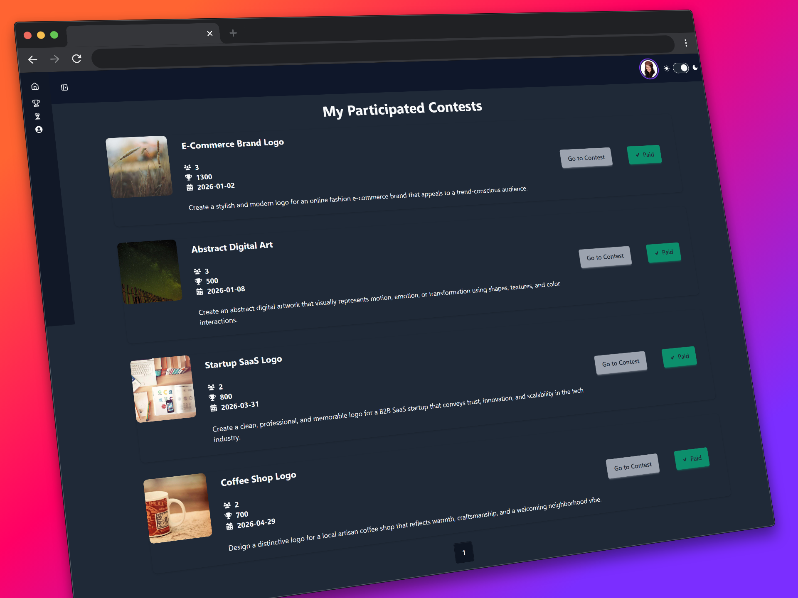
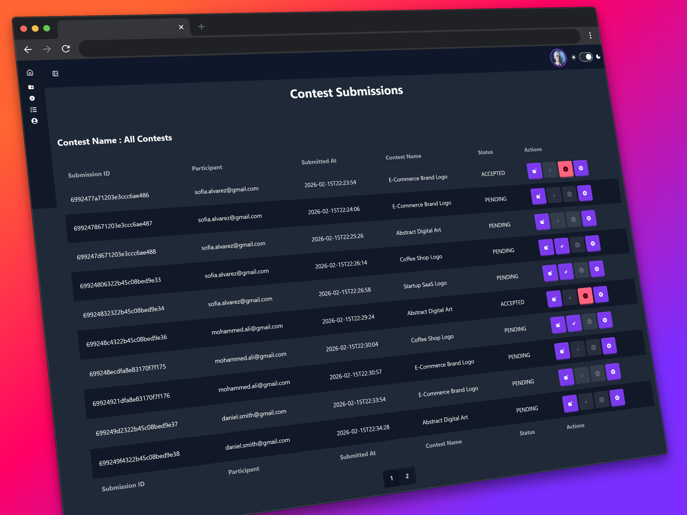
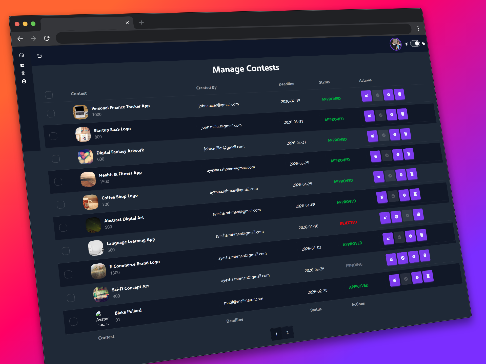
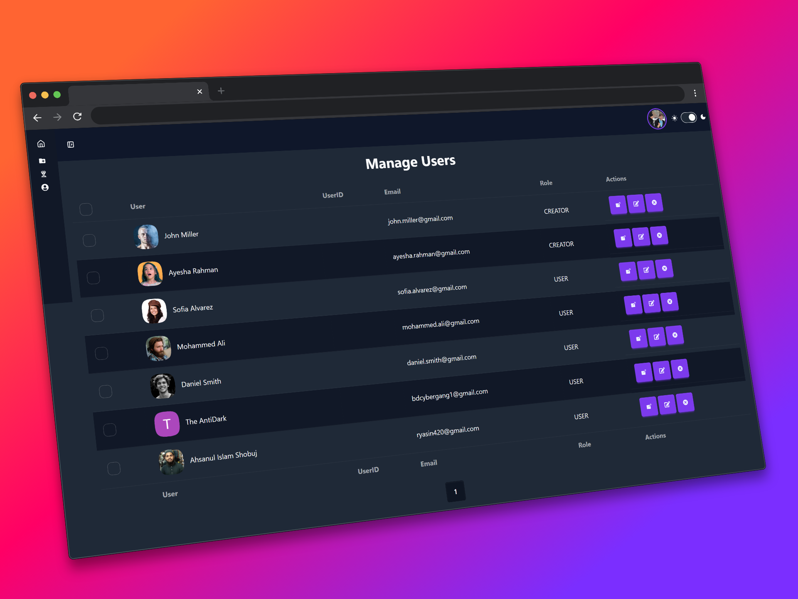

# Contest Forge

[](client/package.json)
[](server/package.json)
[](server/config/db.js)
[](client/src/firebase/firebase.init.js)
[](LICENSE)

Contest Forge is a full-stack contest platform for building, managing, and participating in online contests with role-based workflows for users, creators, and admins.

Keywords: contest platform, coding contest, challenge management, React dashboard, Express API, Firebase auth, MongoDB, role-based access control.

## Table of Contents
- [Why Contest Forge](#why-contest-forge)
- [Features](#features)
- [Screenshots](#screenshots)
- [Tech Stack](#tech-stack)
- [Architecture](#architecture)
- [Project Structure](#project-structure)
- [Quick Start (5 Minutes)](#quick-start-5-minutes)
- [Environment Variables](#environment-variables)
- [Development Workflow](#development-workflow)
- [API Endpoints](#api-endpoints)
- [Authentication and Authorization](#authentication-and-authorization)
- [Deployment](#deployment)
- [Security Notes](#security-notes)
- [License](#license)

## Why Contest Forge
Contest Forge helps teams or communities run structured contests end-to-end:

- Participants discover contests, register, and submit solutions.
- Creators create contests, review submissions, and declare winners.
- Admins manage users and oversee platform-level moderation.

It is designed as a modern full-stack JavaScript workspace with a React SPA frontend and an Express REST API backend.

## Features
- Role-based access control: `user`, `creator`, `admin`
- Firebase email/password and Google authentication
- Contest lifecycle management (create, update, delete, register, deregister)
- Submission workflow with winner declaration and undo winner support
- Leaderboard and public content modules (banner, winners, reviews)
- Protected dashboard routes per role
- React Query data-fetching and secure Axios client with bearer token injection
- Responsive UI built with Tailwind CSS + DaisyUI

## Screenshots

<p align="left">
  
  
</p>

<p align="left">
  
  
</p>

<p align="left">
  
  
</p>

## Tech Stack
| Layer | Technology |
| --- | --- |
| Frontend | React 19, Vite 7, React Router, TanStack React Query |
| UI and Styling | Tailwind CSS 4, DaisyUI, React Icons, AOS, Swiper, Recharts |
| Forms and UX | React Hook Form, React Datepicker, React Toastify, SweetAlert2 |
| Backend | Node.js, Express 5, CORS, Dotenv |
| Authentication | Firebase Authentication (client), Firebase Admin SDK token verification (server) |
| Database | MongoDB Atlas (`mongodb` driver) |
| Deployment | Firebase Hosting (client), Vercel serverless Node deployment (server) |
| Tooling | ESLint (flat config), Vite plugin ecosystem |

## Architecture
Contest Forge follows a split frontend/backend workspace model:

- `client/` serves a component-driven SPA with route-level protection and dashboard UX.
- `server/` exposes REST endpoints with middleware-driven auth and authorization.
- MongoDB stores users, contests, submissions, and homepage data collections.

Core data collections:
- `users`
- `contests`
- `submissions`
- `home`
- `winners`
- `reviews`

## Project Structure
```text
B12A11-contest-forge/
|-- client/
|   |-- public/
|   |-- src/
|   |   |-- Components/          # Reusable UI and loaders
|   |   |-- config/api.js        # Axios instance
|   |   |-- contexts/            # Auth context/provider
|   |   |-- firebase/            # Firebase web initialization
|   |   |-- hooks/               # useAuth, useAxiosSecure, useRole
|   |   |-- layouts/             # Root and dashboard layouts
|   |   |-- pages/               # Route-level pages
|   |   |-- routes/              # Router and guards
|   |   `-- main.jsx             # App bootstrap
|   |-- firebase.json            # Firebase hosting config
|   |-- .firebaserc              # Firebase project alias
|   `-- package.json
|-- server/
|   |-- config/
|   |   |-- db.js                # MongoDB client setup
|   |   |-- firebase.js          # Firebase Admin init
|   |   `-- contest-forge-firebase-adminsdk-pvt-key.json
|   |-- middlewares/auth.js      # Token verification middleware
|   |-- index.js                 # API routes + server bootstrap
|   |-- vercel.json              # Vercel deployment routing
|   `-- package.json
|-- screenshots/
|-- LICENSE
`-- README.md
```

## Quick Start (5 Minutes)
### Prerequisites
- Node.js 18+
- npm 9+
- MongoDB Atlas project
- Firebase project with Authentication enabled

### 1. Clone and Install
```bash
git clone https://github.com/abubakar-arman/B12A11-contest-forge-client.git
git clone https://github.com/abubakar-arman/B12A11-contest-forge-server.git

cd B12A11-contest-forge-client
npm install

cd ../B12A11-contest-forge-server
npm install
```

### 2. Configure Environment Variables
Create `server/.env` and `client/.env` using the examples in the next section.

### 3. Run Backend and Frontend
```bash
# terminal 1
cd server
npm start
```

```bash
# terminal 2
cd client
npm run dev
```

Local app URLs:
- Frontend: `http://localhost:5173`
- Backend: `http://localhost:3000`

## Environment Variables
### Server (`server/.env`)
```env
PORT=3000
DB_USER=your_mongodb_username
DB_PASS=your_mongodb_password
FB_SERVICE_KEY=base64_encoded_firebase_service_account_json
```

`FB_SERVICE_KEY` setup:
1. Download your Firebase service account JSON.
2. Base64 encode the full JSON content.
3. Save the encoded output in `FB_SERVICE_KEY`.

### Client (`client/.env`)
```env
VITE_apiKey=your_firebase_web_api_key
VITE_authDomain=your_project.firebaseapp.com
VITE_projectId=your_project_id
VITE_storageBucket=your_project.appspot.com
VITE_messagingSenderId=your_sender_id
VITE_appId=your_app_id

# Optional demo login shortcuts used in Login page
VITE_admin_email=admin@example.com
VITE_admin_pass=admin_password
VITE_creator_email=creator@example.com
VITE_creator_pass=creator_password
VITE_user_email=user@example.com
VITE_user_pass=user_password
```

## Development Workflow
### Build Frontend
```bash
cd client
npm run build
```

### Preview Frontend Build
```bash
cd client
npm run preview
```

### Lint Frontend
```bash
cd client
npm run lint
```

## API Endpoints
Base URL (local): `http://localhost:3000`

### Public Endpoints
| Method | Endpoint | Description |
| --- | --- | --- |
| GET | `/` | Health/status message |
| POST | `/api/users` | Create user profile record |
| GET | `/api/users/:email/role` | Get role by email |
| GET | `/api/user/exists/:email` | Check user existence |
| GET | `/api/user/:id` | Get user by ID |
| GET | `/api/user/find/:email` | Get user by email |
| GET | `/api/contests` | List contests |
| GET | `/api/contest/:id` | Get contest details |
| GET | `/api/popular-contests` | Top contests by participant count |
| GET | `/api/home/banner` | Homepage banner images |
| GET | `/api/winners` | Winners list |
| GET | `/api/reviews` | Reviews list |

### Protected Endpoints
Requires `Authorization: Bearer <firebase_id_token>`.

| Method | Endpoint | Access |
| --- | --- | --- |
| GET | `/api/users` | Authenticated |
| PUT | `/api/users/:id` | Authenticated |
| DELETE | `/api/users/:id` | Admin |
| POST | `/api/contests` | Creator |
| PUT | `/api/contests/:id` | Authenticated |
| DELETE | `/api/contests/:id` | Authenticated |
| PUT | `/api/contest/register/:id` | Authenticated |
| PUT | `/api/contest/deregister/:id` | Creator |
| PUT | `/api/contest/declare-winner/:id` | Creator |
| PUT | `/api/contest/undo-winner/:id` | Creator |
| GET | `/api/submissions` | Creator |
| POST | `/api/submissions` | Authenticated |
| DELETE | `/api/submissions/:id` | Creator |

## Authentication and Authorization
- Client side uses Firebase Authentication.
- Server side verifies Firebase ID tokens via Firebase Admin SDK.
- Access checks are enforced by role middleware and mirrored in route guards.

Role model:
- `user` for participants
- `creator` for contest managers
- `admin` for platform moderation

## Deployment
### Frontend Deployment (Firebase Hosting)
```bash
cd client
npm run build
firebase deploy
```

### Backend Deployment (Vercel)
```bash
cd server
vercel
```

Required deployment environment variables:
- Backend: `PORT`, `DB_USER`, `DB_PASS`, `FB_SERVICE_KEY`
- Frontend: all required `VITE_*` variables

## Security Notes
- Never commit plaintext secrets.
- Use environment variables and secret managers for production.
- Rotate credentials immediately if exposure is suspected.

## License
This project is licensed under the MIT License. See [LICENSE](LICENSE) for details.
